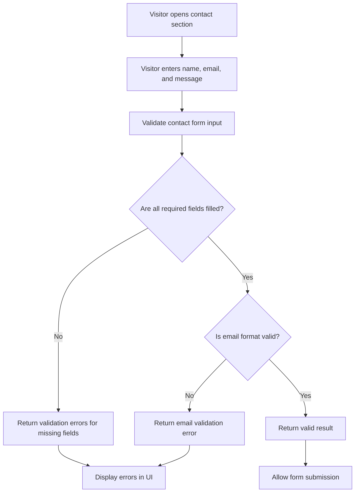

# Flow: Contact Form Validation

## Mermaid Flowchart

## Logic Notes

* Validation must not submit data.
* Validation must not call an API.
* Validation must not modify UI state directly.
* Validation should return a predictable result based only on the provided input.

