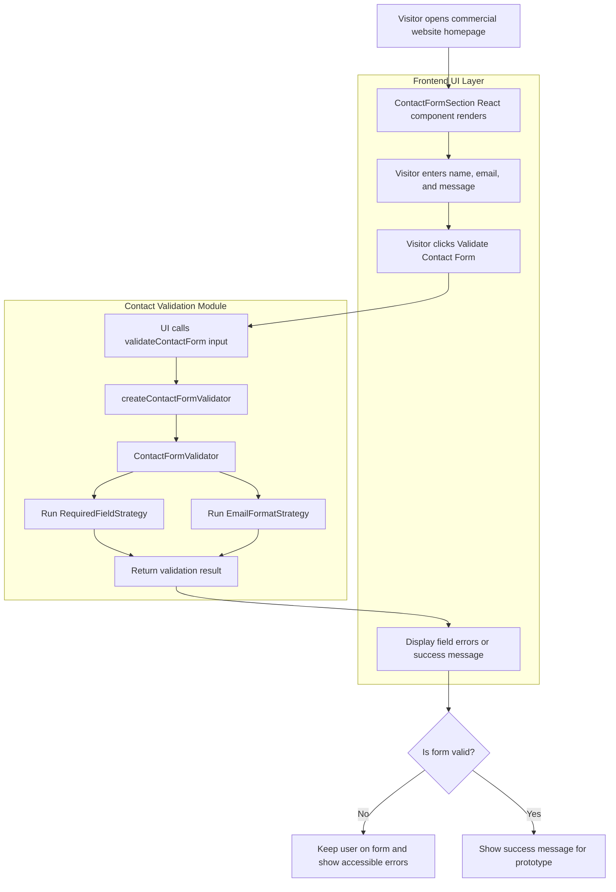

# Flow: Contact Form Validation UI and Strategy Module

## Mermaid Flowchart



## Architecture Notes

- `ContactFormSection` is the frontend UI component.
- `ContactFormSection` imports `validateContactForm` from `src/features/contact-validation`.
- The UI does not duplicate validation rules.
- The UI does not submit data to an API in this prototype.
- The validation module remains responsible for business logic.
- The UI is responsible for collecting input and displaying returned errors.
```
