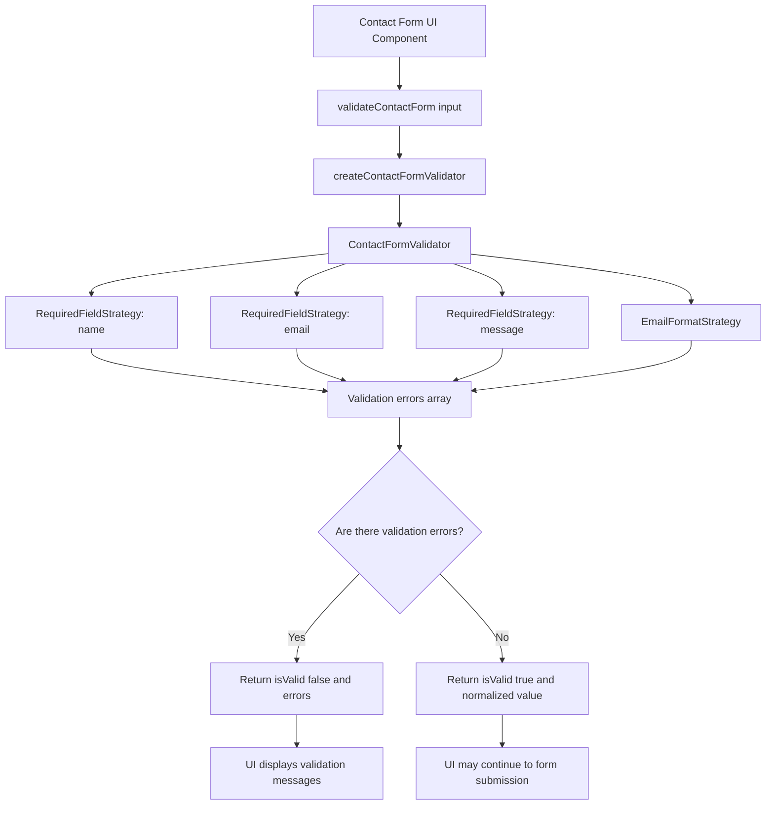

# Flow: Contact Form Validation Module

## Mermaid Flowchart

## Architecture Notes

- The contact form UI depends on the validation module.
- The validation module does not depend on the UI.
- `ContactFormValidator` is the context that runs all validation strategies.
- Each validation strategy owns one validation rule.
- The module returns a validation result instead of causing side effects.
- Form submission is outside the scope of this module.
